# 🚀 Rus-Connect: Система Криптовалютного Трейдинга на Базе ИИ

**Rus-Connect** — это комплексная, самообучающаяся система для криптовалютного трейдинга, использующая ансамбль моделей машинного обучения (LSTM, XGBoost, Transformer) для генерации торговых сигналов с целевой точностью 65-75%. Система оснащена объяснимым ИИ, адаптивным управлением рисками и веб-интерфейсом для мониторинга в реальном времени.

 <!-- Замените на актуальный скриншот -->

## 🎯 Ключевые Особенности

- **🧠 Ансамбль ИИ-моделей**: Комбинация LSTM, XGBoost и Transformer для повышения точности прогнозов.
- **📊 Продвинутая Инженерия Признаков**: Более 50 нормализованных признаков, включая технические индикаторы, данные из стакана ордеров и временные метрики.
- **🔍 Объяснимый ИИ (XAI)**: Детальный анализ каждого сигнала, позволяющий понять, на чем основано решение модели.
- **🛡️ Адаптивное Управление Рисками**: Динамические пороги уверенности и стоп-лоссы для минимизации потерь.
- **📈 Обучение в Реальном Времени**: Модели постоянно дообучаются на новых рыночных данных для адаптации к изменяющимся условиям.
- **🖥️ Интерактивный Веб-интерфейс**: Панель мониторинга для отслеживания сигналов, производительности моделей и состояния системы.

## 🏗️ Архитектура Системы

Система состоит из набора микросервисов, работающих в Docker-контейнерах и взаимодействующих через Kafka.

```mermaid
graph TD
    subgraph "Инфраструктура"
        A[Data Fetcher] --> B{Kafka};
        B --> C[Analytics Engine];
        C --> B;
        D[API Gateway] --> C;
        E[Frontend] --> D;
        C --> F[PostgreSQL];
    end

    subgraph "Пользователь"
        G[Браузер] --> E;
    end

    style A fill:#2a9d8f,stroke:#333,stroke-width:2px
    style C fill:#e9c46a,stroke:#333,stroke-width:2px
    style D fill:#f4a261,stroke:#333,stroke-width:2px
    style E fill:#e76f51,stroke:#333,stroke-width:2px
    style F fill:#264653,stroke:#333,stroke-width:2px
    style B fill:#264653,stroke:#333,stroke-width:2px
```



- **Data Fetcher**: Получает рыночные данные (свечи) с биржи Bybit и отправляет их в Kafka.
- **Analytics Engine**: Ядро системы. Потребляет данные из Kafka, обрабатывает их, генерирует прогнозы с помощью ИИ-моделей и отправляет сигналы обратно в Kafka. Также предоставляет API для получения метрик.
- **API Gateway**: Предоставляет REST API и WebSocket для фронтенда, агрегируя данные из `Analytics Engine` и других сервисов.
- **Frontend**: Веб-приложение на React/TypeScript для визуализации данных и взаимодействия с системой.
- **PostgreSQL**: База данных для хранения исторических данных, сгенерированных сигналов, весов моделей и метрик производительности.
- **Kafka**: Брокер сообщений для асинхронного взаимодействия между сервисами.
- **Redis**: Кэш для временного хранения данных.

## 📋 Требования к Системе

- **Docker Desktop**: Версия 4.0+ (обязательно должен быть запущен).
- **Docker Compose**: Версия 2.0+.
- **ОС**: Windows (с PowerShell), macOS или Linux.
- **ОЗУ**: Минимум 8 ГБ (рекомендуется 16 ГБ).
- **Место на диске**: 5 ГБ свободного места.
- **Интернет-соединение**.

> ⚠️ **ВАЖНО**: Перед выполнением любых команд убедитесь, что Docker Desktop запущен и работает!

## 🚀 Быстрый Запуск

Процесс развертывания полностью автоматизирован с помощью Docker Compose.

### 1. Клонирование Репозитория
Откройте терминал и выполните команду:
```bash
git clone https://github.com/malsasgabriel/rus-connect.git
cd rus-connect
```

### 2. Сборка и Запуск Контейнеров
Эта команда соберет образы всех сервисов и запустит их в фоновом режиме.
```bash
docker-compose up --build -d
```
Первая сборка может занять 10-15 минут в зависимости от скорости вашего интернет-соединения и мощности компьютера.

### 3. Проверка Статуса Сервисов
Убедитесь, что все контейнеры запущены и находятся в состоянии `Up` или `healthy`.
```bash
docker-compose ps
```
Вы должны увидеть примерно следующий вывод:
```
NAME                               STATUS              PORTS
rus-connect-analytics-engine-1     Up (healthy)        0.0.0.0:8081->8081/tcp
rus-connect-api-gateway-1          Up                  0.0.0.0:8080->8080/tcp
rus-connect-data-fetcher-1         Up
rus-connect-frontend-1             Up                  0.0.0.0:3000->3000/tcp
rus-connect-kafka-1                Up (healthy)        0.0.0.0:9092->9092/tcp
rus-connect-postgres-1             Up (healthy)        0.0.0.0:5432->5432/tcp
rus-connect-redis-1                Up (healthy)        6379/tcp
```

### 4. Доступ к Веб-интерфейсу
Откройте ваш браузер и перейдите по адресу: **[http://localhost:3000](http://localhost:3000)**.

Вы должны увидеть главную панель управления. Данные начнут появляться по мере их сбора и обработки, что может занять несколько минут.

## 🛠️ Управление и Мониторинг

### Просмотр Логов
Логоги — основной инструмент для отладки и мониторинга.

- **Просмотр логов всех сервисов в реальном времени:**
  ```bash
  docker-compose logs -f
  ```
- **Просмотр логов конкретного сервиса (например, `analytics-engine`):**
  ```bash
  docker-compose logs -f analytics-engine
  ```
- **Поиск конкретной информации в логах (например, сгенерированных сигналов):**
  ```bash
  # Для PowerShell
  docker-compose logs analytics-engine | findstr "HONEST SIGNAL"

  # Для Linux/macOS
  docker-compose logs analytics-engine | grep "HONEST SIGNAL"
  ```

### Пересборка и Перезапуск Сервисов
Если вы внесли изменения в код одного из сервисов, его нужно пересобрать.

- **Пересобрать и перезапустить конкретный сервис (например, `analytics-engine`):**
  ```bash
  docker-compose up --build -d --no-deps analytics-engine
  ```
- **Перезапустить все сервисы:**
  ```bash
  docker-compose restart
  ```

### Взаимодействие с Базой Данных
Вы можете подключиться к базе данных PostgreSQL для выполнения прямых запросов.

- **Подключиться к psql:**
  ```bash
  docker-compose exec postgres psql -U admin -d predpump
  ```
- **Примеры SQL-запросов:**
  ```sql
  -- Показать последние 10 сгенерированных сигналов
  SELECT symbol, direction, confidence, created_at FROM direction_predictions ORDER BY created_at DESC LIMIT 10;

  -- Посчитать количество свечей для каждого символа
  SELECT symbol, COUNT(*) as candle_count FROM candle_cache GROUP BY symbol;

  -- Посмотреть производительность моделей
  SELECT * FROM model_performance ORDER BY created_at DESC LIMIT 5;
  ```

## ⚙️ API Эндпоинты

API Gateway предоставляет несколько ключевых эндпоинтов для взаимодействия с системой.

- `GET /api/v1/ml/metrics`
  - **Описание**: Возвращает подробные метрики производительности всех ИИ-моделей, включая точность, уверенность и общее состояние системы.
  - **Пример использования:** `curl http://localhost:8080/api/v1/ml/metrics`

- `GET /api/v1/ml/calibration`
  - **Описание**: Возвращает статус калибровки моделей в реальном времени.
  - **Пример использования:** `curl http://localhost:8080/api/v1/ml/calibration`

- `GET /api/v1/trader-mind/full/:symbol`
  - **Описание**: Предоставляет комплексный анализ для указанного символа (`BTCUSDT`, `ETHUSDT` и т.д.), включая агрегированное решение, анализ по каждой модели и оценку риска.
  - **Пример использования:** `curl http://localhost:8080/api/v1/trader-mind/full/BTCUSDT`

## 🐛 Устранение Неполадок

- **Проблема**: Сервисы не запускаются или сразу падают.
  - **Решение**: Убедитесь, что Docker Desktop запущен. Выполните `docker-compose down -v` для полной остановки и удаления всех контейнеров и томов, а затем снова `docker-compose up --build -d`.

- **Проблема**: В веб-интерфейсе нет данных.
  - **Решение**: Проверьте логи `data-fetcher` и `analytics-engine`. Возможно, есть проблемы с подключением к API биржи или обработкой данных. Подождите 5-10 минут, так как системе нужно время для сбора начальных данных.
  ```bash
  docker-compose logs -f data-fetcher analytics-engine
  ```

- **Проблема**: Ошибки `502 Bad Gateway` в браузере.
  - **Решение**: Это означает, что `api-gateway` не может связаться с `analytics-engine`. Проверьте логи `analytics-engine` на наличие ошибок. Убедитесь, что он находится в состоянии `healthy` с помощью `docker-compose ps`.

- **Проблема**: Низкая уверенность сигналов.
  - **Решение**: Это нормально на начальном этапе. Моделям требуется время для сбора данных и калибровки. Проверьте логи `analytics-engine` на сообщения о загрузке исторических данных.

## 🔄 Полная Очистка

Чтобы полностью удалить все данные, включая контейнеры, сети, тома (данные БД) и образы, выполните следующие команды:
```bash
# Остановить и удалить контейнеры, сети и тома
docker-compose down -v

# Удалить все образы, связанные с проектом
docker-compose down --rmi all
```

---

**Счастливого трейдинга! 🚀**